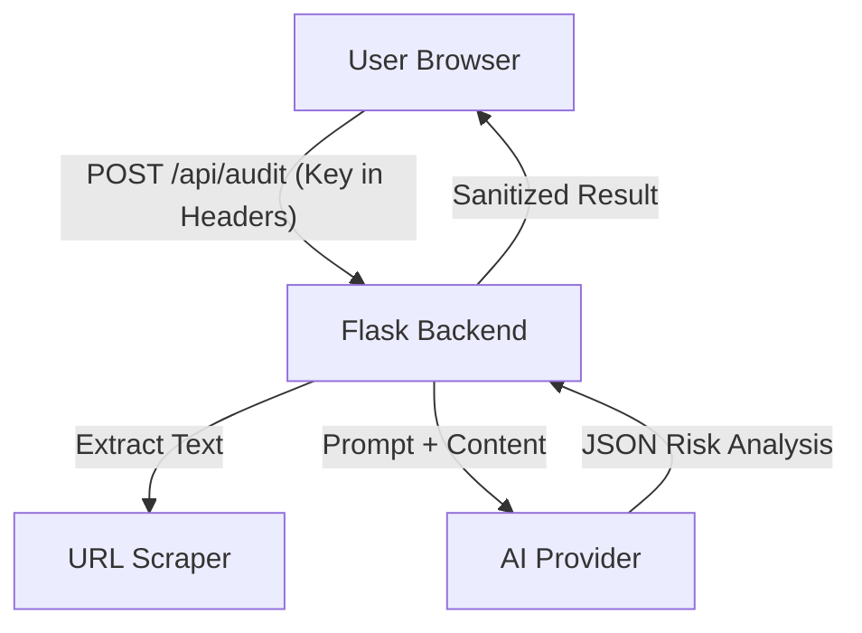

# Architecture: FinePrint

**FinePrint** is a hybrid web application designed to analyze legal documents using advanced LLMs (Large Language Models). It prioritizes user privacy and "Bring Your Own Key" (BYOK) architecture.

## System Overview

The system consists of three main layers:

1.  **Frontend (Client)**: HTML/CSS/JS interface for user interaction and local state management.
2.  **Backend (Server)**: A lightweight Flask application acting as a proxy and orchestrator.
3.  **Intelligence Layer**: External AI Providers (Google Gemini, OpenAI, Anthropic) accessed via the backend.

## 1. Frontend Layer
*   **Technology**: HTML5, CSS3, Vanilla JavaScript.
*   **Responsibility**:
    *   **State Management**: Handles transitions between Choice, Input, Analysis, and Result screens.
    *   **Security**: Stores API Keys in `localStorage` (Client-side only). Keys are sent to the backend *only* during an active request via `x-api-key` headers.
    *   **Rendering**: Parses the JSON response to display "Accept/Refuse" stamps and risk lists.

## 2. Backend Layer
*   **Technology**: Python (Flask).
*   **Entry Point**: `app.py`.
*   **Responsibility**:
    *   Serves static files.
    *   **Endpoint `/api/audit`**:
        *   Accepts `text` or `url`.
        *   Extracts content from URLs using `BeautifulSoup` (removes scripts/styles).
        *   Routes the request to `audit_engine.py`.
        *   Handles errors (400, 429, 500) and maps them to user-friendly messages.

## 3. Audit Engine (`audit_engine.py`)
*   **Responsibility**:
    *   **Prompt Engineering**: Contains the `SYSTEM_PROMPT` that instructs the AI to act as a "Legal Risk Auditor".
    *   **Provider Abstraction**: Switches between `google-genai`, `openai`, and `anthropic` SDKs based on the `x-model-provider` header.
    *   **Mock Fallback**: Includes a regex-based fallback for testing or when no API key is provided (in development).

## Data Flow & Security
1.  **Input**: User pastes text or provides a URL.
2.  **Configuration**: User selects a provider and enters an API Key in the settings modal.
3.  **Transmission**: The request is sent over HTTPS (in production) with the API Key in the header.
4.  **Processing**: The server constructs a prompt combining the System Instructions and the Document.
5.  **Zero Logs**: The backend processes the request in-memory and returns the result. No database storage is used for request content.
