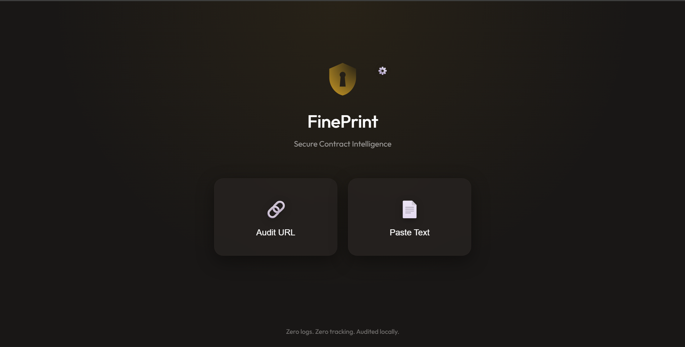

# FinePrint 🛡️



> **Secure Contract Intelligence.**
>
> FinePrint helps you understand the "fine print" in Terms of Service, Privacy Policies, and Contracts. It uses advanced AI to detect high-risk clauses, protecting you from predatory legal terms.

---

## 🌟 Why Use FinePrint?

In a world where clicking "I Agree" is a daily reflex, FinePrint acts as your personal legal shield.

*   **⚡ Instant Analysis**: Paste text or a URL and get a verdict in seconds.
*   **🔒 Privacy First (Zero Logs)**: Your API keys are stored locally in your browser. The server does not store your documents.
*   **🤖 Multi-Model Support**: Powered by your choice of **Google Gemini**, **OpenAI GPT**, or **Anthropic Claude**.
*   **🚦 Clear Verdicts**: We don't just summarize; we give you a concrete **Accept** or **Refuse** recommendation based on risk levels.

---

## 🚀 Features

*   **URL Auditing**: Automatically scrapes and cleans web pages (e.g., Terms pages) for analysis.
*   **Raw Text Analysis**: Paste legal contracts directly for a secure review.
*   **Risk Categorization**:
    *   ⚠️ **High Risk**: Data selling, binding arbitration, waivers of rights.
    *   ✋ **Moderate Risk**: Unclear terms, unilateral changes.
    *   ✅ **Good/Low Risk**: Privacy-friendly clauses, clear opt-outs.
*   **BYOK Architecture**: "Bring Your Own Key" ensures you control the costs and privacy.

---

## 🛠️ Installation & Setup

FinePrint is a lightweight Flask application. Follow these steps to get running in minutes.

### Prerequisites

*   **Python 3.8** or higher.
*   An API Key from [Google AI Studio](https://aistudio.google.com/), [OpenAI](https://platform.openai.com/), or [Anthropic](https://console.anthropic.com/).

### 1. Clone the Repository

```bash
git clone https://github.com/yourusername/vibe-artifacts.git
cd vibe-artifacts/FinePrint
```

### 2. Install Dependencies

It is recommended to use a virtual environment.

```bash
# Create virtual environment
python -m venv venv
source venv/bin/activate  # On Windows: venv\Scripts\activate

# Install requirements
pip install -r requirements.txt
```

### 3. Run the Application

```bash
python app.py
```

The server will start at `http://localhost:5000`.

---

## 📖 Usage Guide

### 1. Configure Your AI Provider

FinePrint requires an API Key to function.

1.  Click the **Gear Icon (⚙️)** in the top center of the home screen.
2.  Select your preferred **AI Model Provider** (e.g., Gemini, OpenAI).
3.  Paste your **API Key**.
4.  Click **Save Configuration**.

> *Note: Keys are saved to your browser's Local Storage. They are only sent to the server when you perform an audit.*

### 2. Perform an Audit

*   **Audit URL**: Click "Audit URL", paste the link to a Terms of Service page, and click **Verify Safe Link**.
*   **Paste Text**: Click "Paste Text", copy-paste the contract text, and click **Scan Protocol**.

### 3. Interpret Results

*   **The Stamp**: You will see a large "ACCEPT" or "REFUSE" stamp.
*   **Risk Breakdown**: Review specific clauses flagged as High, Medium, or Low risk.

---

## 📂 Project Structure

*   `app.py`: Flask server handling API requests and serving the frontend.
*   `audit_engine.py`: Core logic for scraping URLs and interfacing with AI providers.
*   `index.html`: The main single-page application (SPA).
*   `script.js`: Frontend logic for state management and API communication.
*   `ARCHITECTURE.md`: Detailed technical architecture.
*   `CODE_OF_CONDUCT.md`: Community guidelines.

---

## 🤝 Contributing

We welcome contributions! Please read our [Code of Conduct](./CODE_OF_CONDUCT.md) before submitting a Pull Request.

---

*Part of the Vibe-Artifacts collection.*
