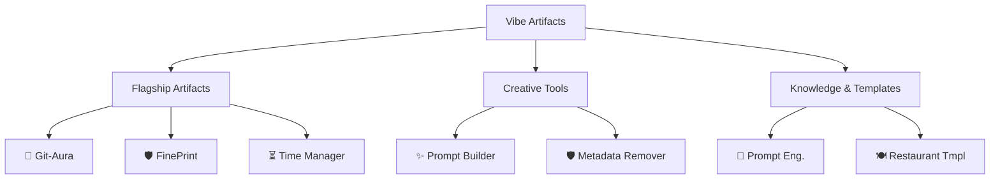

# Vibe Artifacts 🌌

> **A curated collection of high-performance digital artifacts.**
> *Where modern web technologies meet creative coding and aesthetic design.*

Welcome to **Vibe Artifacts**. This repository is a monorepo containing a diverse suite of premium applications, tools, and knowledge bases. Each project is crafted with a focus on **User Experience (UX)**, **Privacy**, and **Performance**.

---

## 📂 Repository Hierarchy

Explore the collection through this structured overview. Click on any project to dive into its documentation.

---

## 💎 The Collection

### 🚀 Flagship Artifacts
*Production-ready applications with deep functionality.*

| Artifact | Description | Tech Stack |
| :--- | :--- | :--- |
| [**Git-Aura**](./git-aura/README.md) | **Cyberpunk Developer Analytics.** Visualize your GitHub activity with cinematic motion and deep insights. | Next.js 16, Motion, Tailwind |
| [**FinePrint**](./FinePrint/README.md) | **Secure Contract Intelligence.** AI-powered contract analysis to detect hidden risks and clauses. | Python (Flask), AI (Gemini/GPT) |
| [**Time Manager**](./Desktop-Time-Manager/README.md) | **Productive Flow.** A native Windows desktop app for distraction-free time tracking. | Rust, SQLite, Windows Native |

### 🛠️ Creative Tools & Privacy
*Utilities designed to enhance your workflow and protect your data.*

| Artifact | Description | Tech Stack |
| :--- | :--- | :--- |
| [**Vibe Prompt Builder**](./Vibe-Prompt-Builder/README.md) | **Next-Gen Prompt Engineering.** A browser extension to craft perfect AI prompts using "Vibe Personalities". | React, TypeScript, Chrome Ext |
| [**Metadata Remover**](./Metadata%20remover/README.md) | **Image Privacy Shield.** Strip invisible EXIF data (GPS, Device info) from your photos before sharing. | HTML5, JS, Client-Side |

### 📚 Knowledge & Templates
*Resources to learn and build.*

| Artifact | Description | Tech Stack |
| :--- | :--- | :--- |
| [**Prompt Engineering**](./prompt%20engineering/README.md) | **The Knowledge Base.** A comprehensive guide to advanced prompting architectures (CoT, ToT, RAG). | Next.js, Markdown |
| [**Restaurant Template**](./Restraunt_Template/README.md) | **Premium Web Template.** A buttery-smooth, animated website template for high-end dining. | React, Vite, GSAP |

---

## 🤝 Contributing

We believe in open-source collaboration. Whether you're fixing a bug, adding a feature, or improving documentation, your contributions are welcome.

1.  Check the specific project's `README.md` for local setup instructions.
2.  Fork the repository.
3.  Create a feature branch.
4.  Submit a Pull Request.

## 📄 License

Individual projects may operate under different licenses. Please refer to the specific project folder for details. Generally, this collection is open for personal and educational use.

---

  Maintained with ❤️ by <a href="https://github.com/aditya452007">aditya452007</a>

