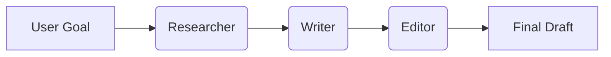

# Agentic Workflows

An **Agent** is an LLM wrapper that has:
1.  **Profile**: Identity and role.
2.  **Memory**: Short-term (conversation) and Long-term (vector DB).
3.  **Planning**: Ability to break goals into steps.
4.  **Tools**: APIs, Search, Calculator.

## Workflow Patterns

### 1. Sequential Handoffs
A linear chain where the output of one agent becomes the input of another.
*   **Researcher Agent** -> **Writer Agent** -> **Editor Agent**

### 2. Hierarchical (Manager-Worker)
A "Manager" agent breaks down a task and delegates sub-tasks to specialized "Worker" agents.

*   **Manager**: "Plan a marketing campaign."
*   **Worker A**: "Analyze competitors."
*   **Worker B**: "Draft copy."

### 3. Mixture of Experts (MoE)
A routing layer decides which specialized agent is best suited for the query.

## Memory Systems

*   **Short-term**: The context window (limited).
*   **Long-term**: Vector databases (infinite, but requires retrieval).

## The Future: Multi-Agent Collaboration

Research (e.g., ChatDev) shows that agents collaborating often outperform a single super-intelligent agent. Diversity of perspective (simulated via personas) reduces error.

> **Key Insight**: We are moving from "Chatting with AI" to "Managing a Team of AI Agents". The prompt engineer is becoming the **AI Product Manager**.
