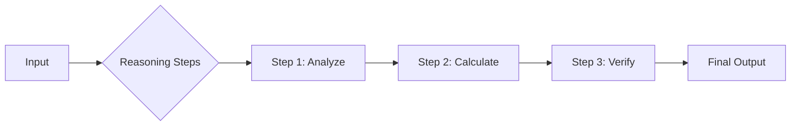

# Chain of Thought (CoT)

Standard prompting asks the model to jump directly from `Input` to `Output`. For complex tasks (math, logic, strategic planning), this often fails. **Chain of Thought (CoT)** forces the model to generate intermediate reasoning steps before arriving at the final answer.

## The Mechanism

CoT decouples the reasoning process from the answer generation. This allows the model to "debug" its own thought process.



## Zero-Shot CoT

The simplest implementation. You simply append a "magic phrase" to the end of your prompt.

> **Prompt**: "Let's think step by step."

This single phrase can significantly boost performance on benchmark reasoning tasks (e.g., GSM8K). It triggers the model to output a sequence of thoughts rather than just a token.

## Manual CoT (Few-Shot CoT)

For higher reliability, you provide examples of *how* to reason.

```text
Q: Roger has 5 tennis balls. He buys 2 more cans of tennis balls. Each can has 3 tennis balls. How many tennis balls does he have now?

A: Roger started with 5 balls.
2 cans of 3 balls each is 2 * 3 = 6 balls.
5 + 6 = 11.
The answer is 11.

Q: The cafeteria had 23 apples. If they used 20 to make lunch and bought 6 more, how many apples do they have?
```

## Least-to-Most Prompting

A variant of CoT where the model is first asked to decompose a complex problem into sub-problems, and then solve them sequentially.

1.  **Decomposition**: "To solve this, what questions do I need to answer first?"
2.  **Execution**: Solving each sub-question.

> **Key Insight**: CoT increases latency (more tokens generated) but drastically increases accuracy for logic-heavy tasks. It is the foundation of "System 2" thinking in LLMs.
