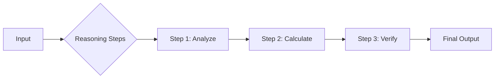

# Chain of Thought (CoT)

Standard prompting ("System 1" thinking) asks the model to jump directly from `Input` to `Output`. For complex tasks—math, logic, symbolic reasoning, strategic planning—this often leads to failure.

**Chain of Thought (CoT)** forces the model to generate intermediate reasoning steps ("System 2" thinking) before arriving at the final answer. This decoupling allows the model to "debug" its own thought process.

## The Mechanism



By generating more tokens, the model is essentially "buying time" to compute. It uses the generated tokens as a scratchpad, attending to previous steps to inform the next one.

## Zero-Shot CoT

The simplest implementation. You append a "magic phrase" to the end of your prompt.

> **Prompt**: "Let's think step by step."

This single phrase triggers the model to decompose the problem.
*   **Performance**: Can increase accuracy on GSM8K (math benchmark) from ~17% to ~78% (Wei et al., 2022).
*   **Variation**: "Let's work this out in a step-by-step way to be sure we have the right answer." (Emotional/Accuracy framing).

## Manual CoT (Few-Shot CoT)

For higher reliability, you provide examples of *how* to reason. This is superior to Zero-Shot CoT because you define the *style* and *depth* of the reasoning.

**Prompt Template:**
```text
Q: [Question]
A: [Reasoning Steps]
The answer is [Answer].
```

**Example:**
```text
Q: Roger has 5 tennis balls. He buys 2 more cans of tennis balls. Each can has 3 tennis balls. How many tennis balls does he have now?

A: Roger started with 5 balls.
2 cans of 3 balls each is 2 * 3 = 6 balls.
5 + 6 = 11.
The answer is 11.

Q: The cafeteria had 23 apples. If they used 20 to make lunch and bought 6 more, how many apples do they have?
```

## Advanced Techniques

### 1. Self-Consistency (Majority Voting)
LLMs are probabilistic. If you run the same CoT prompt 5 times, you might get 5 different reasoning paths.
**Technique**:
1.  Generate `k=5` different reasoning paths (with high temperature, e.g., 0.7).
2.  Extract the final answer from each.
3.  Take the majority vote.
*   *Benefit*: Drastically reduces hallucination and arithmetic errors.

### 2. Least-to-Most Prompting
For problems that are too hard for a single CoT pass.
1.  **Decomposition**: Ask the model to break the problem into sub-questions.
    *   *Prompt*: "To solve this, what questions do I need to answer first?"
2.  **Sequential Solving**: Feed the answer to Sub-Q 1 into the prompt for Sub-Q 2.

### 3. Complexity-Based Consistency
Instead of just voting, prioritize the reasoning paths that are longer or more complex, as they often correlate with more rigorous analysis (Fu et al., 2023).

## When to Use CoT?

| Use Case | Standard Prompting | Chain of Thought |
| :--- | :--- | :--- |
| **Creative Writing** | ✅ Excellent | ❌ Too rigid |
| **Simple Retrieval** | ✅ Efficient | ❌ Waste of tokens |
| **Math / Logic** | ❌ Fails often | ✅ Essential |
| **Coding** | ❌ Buggy | ✅ Explains logic first |

> **Key Insight**: CoT increases latency (more tokens generated) but drastically increases accuracy. It transforms the LLM from a text predictor into a reasoning engine.
