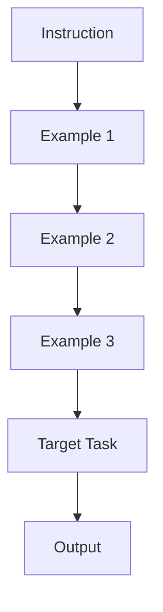

# Few-Shot Architectures

Few-Shot Prompting (also known as **In-Context Learning**) involves providing the model with a set of input-output pairs (demonstrations) before asking it to perform a task. This drastically improves performance on complex tasks, formatting compliance, and style mimicry.

## The Mechanism

By providing examples, you are essentially "fine-tuning" the model temporarily within the prompt window. The model analyzes the patterns in your examples and applies them to the new input.



## The Power of Exemplars

The examples you choose (Exemplars) are the most critical part of a Few-Shot prompt. Good examples can make a 7B model outperform a 70B model.

### 1. Label Space Distribution
If your task involves classification (e.g., Sentiment Analysis), ensure your examples cover the full range of labels in a balanced way.
*   **Imbalance Risk**: If you provide 3 "Positive" examples and 1 "Negative", the model becomes biased toward "Positive".
*   **The "Unknown" Label**: Always include an example where the model should refuse to answer or output "Unknown". This reduces hallucinations.

### 2. Format Consistency
The model is a pattern-matching machine. If your examples follow a specific structure (e.g., `Input -> Thinking -> Output`), the model will replicate that structure.

**Bad Example (Inconsistent):**
```text
Input: A
Output: Alpha

Input: B
Output: The answer is Beta
```

**Good Example (Consistent):**
```text
Input: A
Output: Alpha

Input: B
Output: Beta
```

## Selection Strategies

How do you choose which examples to include?

*   **Fixed K-Shot**: Using a static set of 3-5 high-quality examples. Simple but rigid.
*   **Dynamic K-Shot (K-NN Selection)**:
    1.  Create a database of 100+ labeled examples.
    2.  When a user query comes in, embed the query.
    3.  Find the top-k most similar examples from your database (using Cosine Similarity).
    4.  Insert those specific examples into the prompt.
    *   *Benefit*: The model always sees examples relevant to the current problem.

## Advanced Nuances

### Sensitivity to Ordering (Recency Bias)
Models are sensitive to the order of examples. They often prioritize the last example (Recency Bias).
*   **Mitigation**: If possible, randomize the order of examples across runs, or place the most representative examples last.

### The "Label Space" Impact
Interestingly, research (Min et al., 2022) showed that for some tasks, the *correctness* of the labels matters less than the *format*. You can sometimes provide random labels, and the model still improves simply because it learned the *output format*.
*   *Caveat*: This applies more to classification/formatting. For reasoning (Chain of Thought), the correctness of the reasoning steps is crucial.

## Detailed Example: SQL Generation

**Prompt:**
```sql
-- Convert natural language to SQL.
-- Schema: Users(id, name, signup_date), Orders(id, user_id, amount)

Example 1:
Input: Show me all users.
Output: SELECT * FROM Users;

Example 2:
Input: Count the number of orders for user 'John'.
Output: SELECT COUNT(*) FROM Orders JOIN Users ON Orders.user_id = Users.id WHERE Users.name = 'John';

Example 3:
Input: Find users who signed up in 2023.
Output: SELECT * FROM Users WHERE signup_date >= '2023-01-01' AND signup_date <= '2023-12-31';

Input: Show me the top 5 spenders.
Output:
```

> **Key Insight**: Few-Shot prompting bridges the gap between a generic model and a specialized tool. It is often more effective (and cheaper) than fine-tuning for adapting general-purpose models to specific, lightweight tasks.
