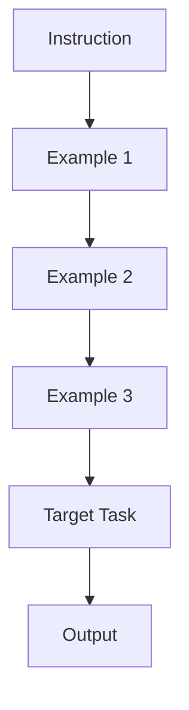

# Few-Shot Architectures

Few-Shot Prompting (also known as In-Context Learning) involves providing the model with a set of examples (demonstrations) before asking it to perform a task. This drastically improves performance on complex tasks, formatting compliance, and style mimicry.

## The Mechanism

By providing examples, you are essentially "fine-tuning" the model temporarily within the prompt window.



## The Power of Exemplars

The examples you choose (Exemplars) are the most critical part of a Few-Shot prompt.

### 1. Label Space Distribution
If your task involves classification (e.g., Sentiment Analysis), ensure your examples cover the full range of labels (Positive, Negative, Neutral) in a balanced way.

### 2. Format Consistency
The model is a pattern-matching machine. If your examples follow a specific structure (e.g., `Input -> Thinking -> Output`), the model will replicate that structure.

```text
Classify the sentiment of the following tweets:

Tweet: "I love this product!"
Sentiment: Positive

Tweet: "This is the worst service ever."
Sentiment: Negative

Tweet: "It arrived on time."
Sentiment: Neutral

Tweet: "I'm not sure how I feel about this."
Sentiment:
```

## Selection Strategies

*   **Fixed K-Shot**: Using a static set of 3-5 high-quality examples.
*   **Dynamic K-Shot (RAG)**: Dynamically retrieving the most relevant examples from a database based on the user's current query. This is highly effective for large datasets.

## Common Pitfalls

*   **Recency Bias**: Models tend to over-prioritize the examples at the very end of the prompt.
*   **Example Contamination**: If your examples contain wrong information, the model might adopt the error as a rule.

> **Key Insight**: Few-Shot prompting is often more effective than fine-tuning for adapting general-purpose models to specific, lightweight tasks.
