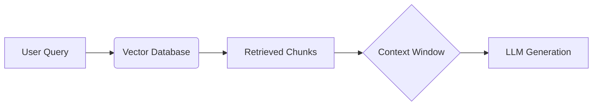

# RAG-Optimized Prompting

**Retrieval-Augmented Generation (RAG)** allows an LLM to access a private database of knowledge. However, dumping text into a prompt is not enough. The prompt must be architected to handle noise, conflict, and length.

## The Architecture



## The "Lost in the Middle" Phenomenon

Research shows that LLMs are best at using information at the **beginning** and **end** of the input context. Information buried in the middle is often ignored.

**Optimization Strategy**:
*   Place the most critical instructions at the very end ("Recency Bias").
*   Place the most relevant retrieved chunks at the beginning.

## Prompt Structure for RAG

```markdown
### SYSTEM
You are a helpful assistant. Answer the user's question using ONLY the provided context.
If the answer is not in the context, say "I don't know."

### CONTEXT
[Chunk 1: High Relevance]
[Chunk 2: Medium Relevance]
[Chunk 3: Low Relevance]

### USER QUERY
How do I reset my password?

### FINAL INSTRUCTION
Answer the query based on the context above. Be concise.
```

## Handling Hallucinations

To prevent the model from using its pre-trained knowledge instead of the retrieved context:
1.  **Negative Constraints**: "Do not use outside knowledge."
2.  **Citation Requirement**: "Cite the chunk ID for every claim."

> **Key Insight**: RAG is not just about the database; it is about the **Context Injection Protocol**. How you format the injected data determines the quality of the answer.
