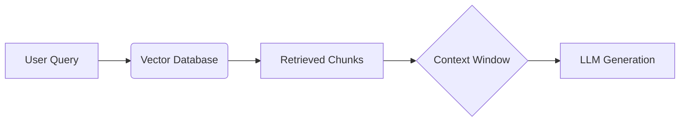

# RAG-Optimized Prompting

**Retrieval-Augmented Generation (RAG)** allows an LLM to access a private database of knowledge. However, simply retrieving text and dumping it into the prompt is not enough. The prompt must be architected to handle noise, conflict, and token limits.

## The Architecture



## The "Lost in the Middle" Phenomenon

Research (Liu et al., 2023) shows that LLMs are U-shaped in their attention. They are best at using information at the **beginning** (Primacy Bias) and **end** (Recency Bias) of the input context. Information buried in the middle is often ignored.

**Optimization Strategy:**
1.  **Re-ranking**: After retrieval, use a Cross-Encoder to score chunks by relevance.
2.  **Layout**: Place the most critical instructions at the very end. Place the most highly-rated chunks at the beginning.

## Prompt Structure for RAG

```markdown
### SYSTEM
You are a helpful assistant. Answer the user's question using ONLY the provided context.
If the answer is not in the context, say "I don't know."

### CONTEXT
[Chunk ID: 12]
(Content of highly relevant chunk...)

[Chunk ID: 45]
(Content of medium relevant chunk...)

### USER QUERY
How do I reset my password?

### FINAL INSTRUCTION
Answer the query based on the context above.
Cite the Chunk ID for every claim (e.g., [12]).
Be concise.
```

## Advanced Techniques

### 1. HyDE (Hypothetical Document Embeddings)
Users often ask bad queries. "Login broken."
HyDE asks the LLM to write a *hypothetical* good answer first.
*   *Prompt*: "Write a paragraph about how to fix login issues."
*   *Result*: "To fix login issues, check your password, clear cache..."
*   *Action*: Embed this hypothetical answer and search for *that*. It matches the semantic content of the documentation better than the user's short query.

### 2. Context Compression
Instead of pasting full documents, use an LLM to summarize or extract only the relevant sentences from the retrieved chunks *before* feeding them to the final generation step.

### 3. Citations
To force grounding, require the model to output citations.
*   *Instruction*: "Every sentence must end with a citation [Source ID]."
*   *Benefit*: Allows users to verify the source and reduces hallucination (because the model has to "look" at the source ID).

> **Key Insight**: RAG is not just about the database; it is about the **Context Injection Protocol**. The quality of the answer is determined by *how* you format the injected data within the prompt's limited attention span.
