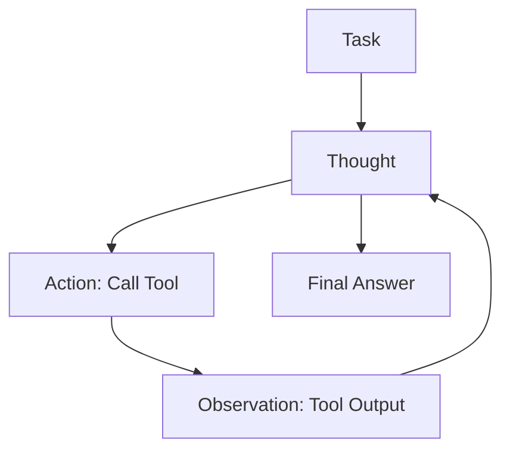

# ReAct Framework

**ReAct** (Reason + Act) is the paradigm that allows LLMs to interact with the external world. Unlike CoT (which is purely internal reasoning), ReAct interleaves **Thought**, **Action**, and **Observation**.

## The Loop

The model operates in a continuous loop until the task is complete.



## The Components

1.  **Thought**: The model reasons about the current state. *"I need to find out who won the 2024 Super Bowl."*
2.  **Action**: The model emits a specific command. `SEARCH("2024 Super Bowl winner")`
3.  **Observation**: The environment returns the result. *"Kansas City Chiefs"*
4.  **Reasoning Update**: The model processes the new info. *"Okay, now I need to find their quarterback."*

## Why It Matters

Without ReAct, LLMs are isolated brains in a jar. ReAct gives them hands. It is the foundational architecture for all modern "Agents" (AutoGPT, LangChain Agents).

## Example Trace

```text
Question: What is the elevation range of the area that the eastern sector of the Colorado orogeny extends into?

Thought 1: I need to search for Colorado orogeny, find the area that the eastern sector extends into, and then find the elevation range of the area.
Action 1: Search[Colorado orogeny]
Observation 1: The Colorado orogeny was an episode of mountain building (an orogeny) in Colorado and surrounding areas.

Thought 2: It does not mention the eastern sector. So I need to look up eastern sector.
Action 2: Lookup[eastern sector]
Observation 2: (Result 1 / 1) The eastern sector extends into the High Plains and is called the Central Plains orogeny.

Thought 3: The eastern sector of Colorado orogeny extends into the High Plains. I need to search High Plains elevation.
Action 3: Search[High Plains]
...
```

> **Key Insight**: ReAct overcomes the "hallucination" problem by grounding reasoning in external, verifiable facts retrieved via tools.
