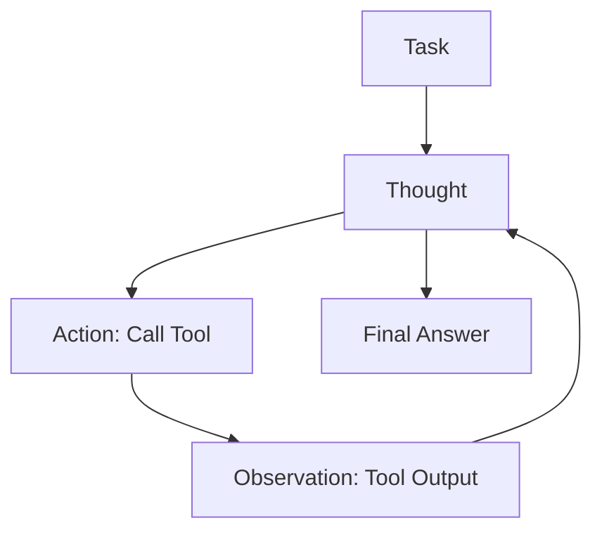

# ReAct Framework

**ReAct** (Reason + Act) is the paradigm that allows LLMs to interact with the external world. Unlike CoT (which is purely internal reasoning), ReAct interleaves **Thought**, **Action**, and **Observation**. It is the engine behind agents like AutoGPT and LangChain.

## The Loop

The model operates in a continuous loop until the task is complete (or max iterations reached).

## The Components

1.  **Thought**: The model reasons about the current state. *"I need to find out who won the 2024 Super Bowl."*
2.  **Action**: The model emits a specific command from a pre-defined list. `SEARCH("2024 Super Bowl winner")`
3.  **Observation**: The environment (Python script) executes the tool and returns the result string. *"Kansas City Chiefs"*
4.  **Reasoning Update**: The model processes the new info. *"Okay, now I need to find their quarterback."*

## Detailed Trace Analysis

Here is what a real ReAct trace looks like for the question: *"Who is the current CEO of the company that created the iPhone?"*

**Step 1**
*   **Thought**: I need to find the company that created the iPhone, then find its CEO.
*   **Action**: `Search["company created iPhone"]`
*   **Observation**: Apple Inc. designed and markets the iPhone.

**Step 2**
*   **Thought**: The company is Apple. Now I need to find the CEO of Apple.
*   **Action**: `Search["current CEO of Apple"]`
*   **Observation**: Tim Cook is the chief executive officer of Apple Inc.

**Step 3**
*   **Thought**: I have the answer.
*   **Action**: `Finish["Tim Cook"]`

## Handling Tool Hallucinations

Models often hallucinate tools that don't exist (e.g., `Calculator.solve()`).

**Mitigation Strategy:**
1.  **Schema Definition**: In the system prompt, strictly define the available tools and their arguments (JSON Schema).
2.  **Error Feedback**: If the model calls a bad tool, the Observation should be: *"Error: Tool 'X' not found. Available tools: [A, B]. Try again."* This allows the ReAct loop to self-correct.

## ReAct vs. CoT

*   **CoT**: Pure reasoning. Good for static knowledge. "What is 20 * 20?"
*   **ReAct**: Reasoning + Retrieval. Good for dynamic/external knowledge. "What is the stock price of Apple right now?"

> **Key Insight**: ReAct overcomes the "hallucination" problem by grounding reasoning in external, verifiable facts. It turns the LLM into a **Controller** for software tools.
