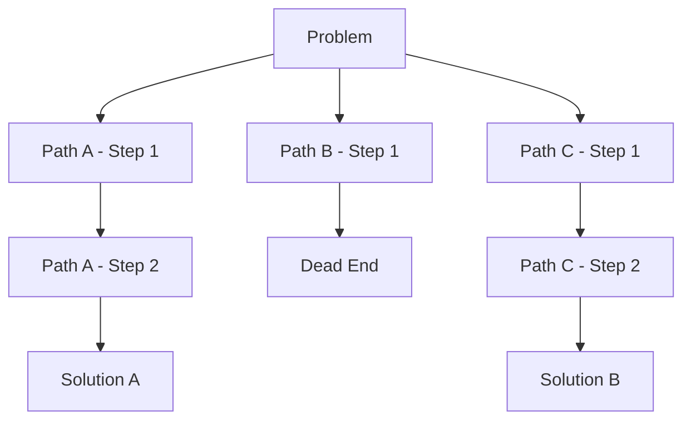

# Tree of Thoughts (ToT)

While **Chain of Thought** is linear, **Tree of Thoughts (ToT)** is non-linear. It allows an LLM to explore multiple reasoning paths simultaneously, backtracking when necessary, much like a chess engine evaluating moves.

## The Mechanism

ToT treats reasoning as a search problem over a tree structure. Each node is a "thought" (a coherent text sequence).



## The Four Phases of ToT

1.  **Decomposition**: Breaking the problem into intermediate steps.
2.  **Thought Generation**: Generating multiple potential next steps (k candidates).
3.  **State Evaluation**: Heuristic evaluation of each state.
    *   *Value*: "Sure/Likely/Impossible"
    *   *Vote*: Asking the model to vote on the best path.
4.  **Search Algorithm**:
    *   **BFS (Breadth-First Search)**: Explore all options at the current depth (good for creative writing).
    *   **DFS (Depth-First Search)**: Follow a path to the end, then backtrack (good for coding/puzzles).

## Implementation Example

You don't need a complex framework to simulate ToT. You can use a structured prompt:

```text
Imagine three different experts are answering this question.
All experts will write down 1 step of their thinking, then share it with the group.
Then all experts will critique the next step.
If any expert realizes they are wrong, they backtrack.
```

## Use Cases

*   **Creative Writing**: Exploring different plot twists.
*   **Coding**: Debugging where multiple root causes are possible.
*   **Strategic Planning**: Scenario analysis.

> **Key Insight**: ToT trades significant computational cost (many more tokens) for higher success rates on tasks requiring lookahead and planning.
