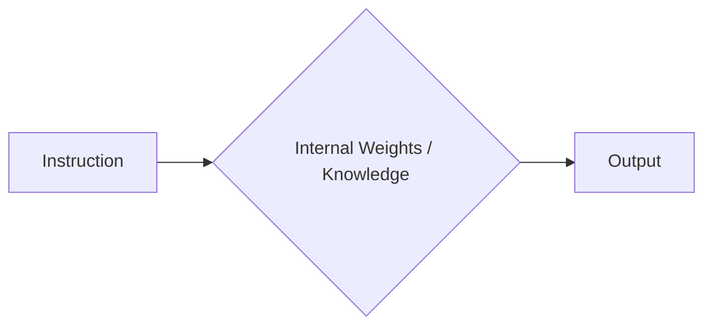

# Zero-Shot Architectures

Zero-Shot prompting is the art of extracting intelligence from a model without providing prior examples (exemplars). It relies entirely on the model's pre-trained knowledge and its ability to follow instructions ("Instruction Tuning"). While seemingly simple, mastering Zero-Shot requires a deep understanding of how models interpret intent.

## The Mechanism

In a Zero-Shot scenario, the model must bridge the gap between the **Instruction** and the **Response** using only its internal weights.



This is the default mode for most conversational interactions (ChatGPT, Claude). It works best for tasks the model has seen frequently during training (e.g., summarization, translation, code generation).

## Role-Playing (Persona Adoption)

One of the most powerful Zero-Shot techniques is **Persona Adoption**. By assigning a specific role, you steer the model into a specific subspace of its training data.

### The "Simulated Expert" Effect
When you simply ask a question, the model responds as a "generic helpful assistant" (the average of its RLHF training).
When you assign a persona, you align the model's predictive distribution with expert content found in its training corpus.

**Standard Prompt:**
> "Write a marketing email for a new coffee brand."

**Optimized Prompt (Persona):**
> "You are a world-class Direct Response Copywriter with 20 years of experience. You admire David Ogilvy and Gary Halbert. Your style is punchy, emotional, and focuses heavily on the 'benefit of the benefit'. Write a marketing email for a new luxury coffee brand targeting busy millennials."

**Why this works:**
1.  **Vocabulary Shift**: The model unlocks specific jargon ("benefit of the benefit", "CTA", "hook").
2.  **Tone Alignment**: It adopts the confidence and cadence of a professional.
3.  **Prioritization**: It knows what matters in that domain (conversion > fluff).

## Instruction Tuning Nuances

Modern LLMs (GPT-4, Claude 3.5, Llama 3) are heavily "Instruction Tuned" (SFT + RLHF). They are optimized to follow direct commands.

### 1. The "EmotionPrompt" Phenomenon
Research (Li et al., 2023) suggests that adding emotional stakes can improve performance and compliance in Zero-Shot scenarios. This is likely a byproduct of RLHF, where helpfulness is rewarded.

*   *"This is critical for my career."*
*   *"You must be accurate."*
*   *"I have a disability and need this explained simply."* (Note: This can sometimes bypass safety filters or trigger simpler language).
*   *"Take a deep breath and work on this step by step."* (Combines CoT with emotion).

### 2. Negative Constraints vs. Positive Instructions
Models struggle with "Negative Constraints" (Don't do X) because the token "X" is now in the context window, priming the model to generate it.

*   *Weak*: "Do not write long sentences."
*   *Strong*: "Use short, punchy sentences. Keep all sentences under 15 words."

### 3. Output Enforcement
To ensure machine-readable output in Zero-Shot, you must be draconian with your instructions.

```markdown
Output strictly in JSON format.
Do not include any "Here is the JSON" conversational filler.
Start with `{` and end with `}`.
```

## Simulated Few-Shot

You can sometimes "fake" a Few-Shot experience within a Zero-Shot prompt by describing the *structure* of an example without actually providing one.

> "Structure your response exactly like a scientific abstract: start with the Background, then Method, then Results, and finally Conclusion."

## Limitations & Failure Modes

Zero-Shot is powerful but fragile. It often fails at:
1.  **Complex Logic**: Tasks requiring multiple reasoning steps (see **Chain of Thought**).
2.  **Specific Formats**: Strict adherence to unique JSON schemas often requires examples (see **Few-Shot**).
3.  **Nuance**: Capturing a very specific brand voice is hard to describe in abstract terms; examples work better.
4.  **Hallucination**: Without ground truth examples, the model is more likely to invent facts to satisfy the instruction.

> **Key Insight**: Use Zero-Shot for general knowledge tasks, creative writing, or when you simply don't have examples. For structured logic, proprietary tasks, or strict formatting, you must graduate to **Few-Shot**.
