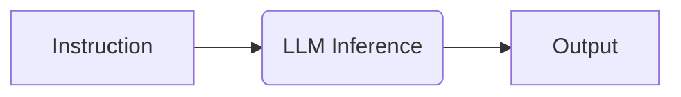

# Zero-Shot Architectures

Zero-Shot prompting is the art of extracting intelligence from a model without providing prior examples. It relies entirely on the model's pre-trained knowledge and its ability to follow instructions ("Instruction Tuning").

## The Mechanism

In a Zero-Shot scenario, the model must bridge the gap between the **Instruction** and the **Response** using only its internal weights.



## Role-Playing (Persona Adoption)

One of the most powerful Zero-Shot techniques is **Persona Adoption**. By assigning a specific role, you steer the model into a specific subspace of its training data.

> **Why it works**: The training data contains vast amounts of text written by "experts". By invoking the expert persona, you align the model's predictive distribution with that expert content.

**Standard Prompt:**
```text
Write a marketing email for a new coffee brand.
```

**Optimized Prompt:**
```text
You are a world-class copywriter with 10 years of experience at top agencies (Ogilvy, Leo Burnett).
Your style is punchy, emotional, and persuasive.
Write a marketing email for a new luxury coffee brand targeting millennials.
```

## Instruction Tuning Nuances

Modern LLMs (GPT-4, Claude 3.5) are heavily "Instruction Tuned" (RLHF). This means they are optimized to follow direct commands. However, they can still hallucinate or be lazy.

### Emotional Blackmail (The "Urgency" Hack)
Research suggests that adding emotional stakes can improve compliance in Zero-Shot scenarios, though this is a quirk of current RLHF alignment.

*   *"This is critical for my career."*
*   *"Ensure the answer is unbiased and covers all viewpoints."*

## Limitations

Zero-Shot is powerful but fragile. It often fails at:
1.  **Complex Logic**: Tasks requiring multiple reasoning steps.
2.  **Specific Formats**: Strict adherence to unique JSON schemas (without examples).
3.  **Nuance**: Capturing a very specific brand voice.

> **Key Insight**: Use Zero-Shot for general knowledge tasks or creative writing. For structured logic or strict formatting, move to **Few-Shot**.
